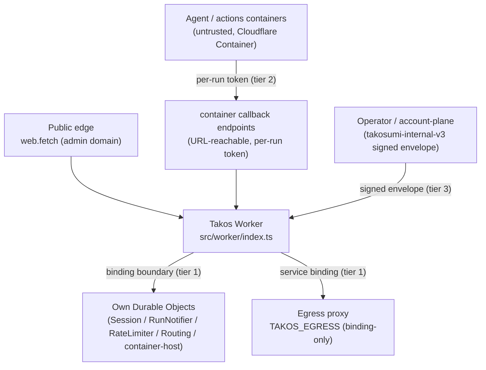

# Architecture Diagrams

**Takos is the OpenTofu-native AI workspace distribution managed by external Takosumi control plane.** Takosumi is the OpenTofu-native deploy control plane: Takos's deploy
topology is an OpenTofu Capsule (`deploy/opentofu`, `var.target = cloudflare`)
that Takosumi **installs and applies**, recording the run ledger as **Capsule -> Run -> StateVersion -> Output**. Connections hold credential references, ProviderBindings resolve each provider (+ optional alias) to an explicit provider connection (an explicit ProviderConnection), and policy resolves provider allowlists, state backend, and Cloudflare Container execution.

## Deploy flow (Takosumi run ledger)

```mermaid
flowchart LR
  M["Takos OpenTofu module<br/>deploy/opentofu (var.target)"]
  subgraph TS["Takosumi (deploy control plane)"]
    I["Capsule"]
    P["`plan` type Run<br/>(tofu plan)"]
    A["`apply` type Run<br/>(tofu apply)"]
    DP["`destroy_plan` / `destroy_apply`<br/>(teardown)"]
    O["Output<br/>(non-secret URLs / binding map)"]
  end
  RP["ProviderConnection / ProviderBinding / policy<br/>provider allowlist · credentials ·<br/>state backend · Container execution"]
  M --> I --> P --> A --> S["StateVersion"] --> O
  I --> DP
  RP -. owns execution & credentials .-> P
  RP -. owns execution & credentials .-> A
```

For the `cloudflare` target, the applied module provisions the backing resources (D1 / KV / R2 / Queues) and the
Worker-script layer consumes the resulting binding map. The hand-maintained
`takosumi-private/platform/wrangler.toml` plus operator-local secrets outside the repo is the **interim reference
materialization** of this same topology, converging onto the Takosumi-applied module — not a separate source of truth.

## Runtime shape (one Worker)



Trust boundaries are properties of this Takosumi-applied topology, validated by the reviewed plan. See
[Internal trust boundaries](./internal-trust-boundaries.md) for the canonical decision on tier 1 (binding boundary),
tier 2 (per-run capability token), and tier 3 (signed-request envelope).

## Boundary

Takos owns the product surface (chat, agent, memory, Workspaces, Git service profile UX, bundled-app launcher metadata,
file-handler metadata, MCP-facing product metadata). Takosumi records the run ledger (Capsule / Run / StateVersion / Output) and the ProviderConnection / ProviderBinding / policy-owned execution. The Takosumi Accounts plane owns
account-plane policy: account, billing, OIDC, and dashboard.

## References

- [Deploy overview](/deploy/)
- [Internal trust boundaries](./internal-trust-boundaries.md)
- [Takosumi specification](https://takosumi.com/docs/reference/model)
