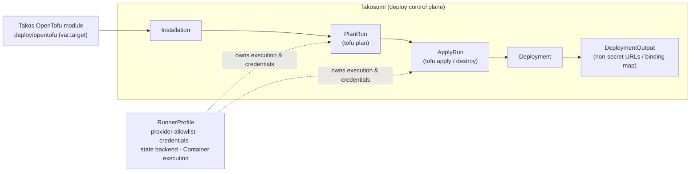
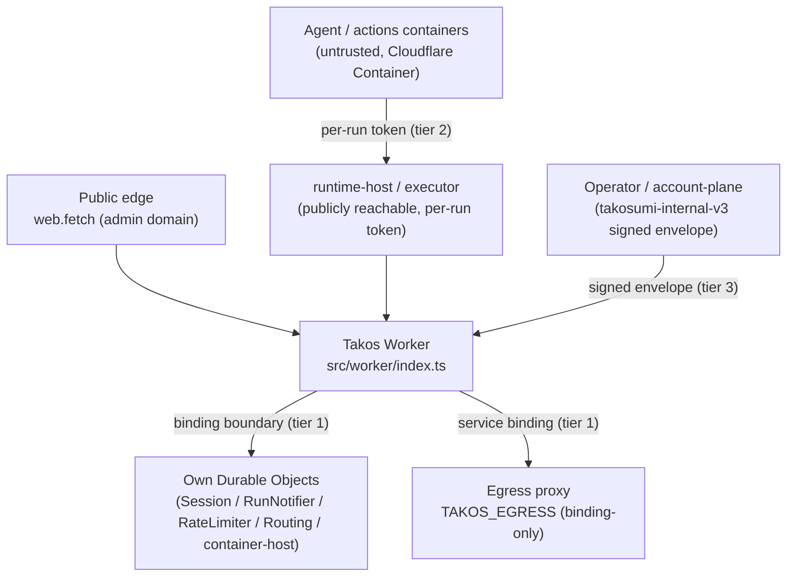

# Architecture Diagrams

**Takos is a product that runs on Takosumi.** Takosumi is the OpenTofu-native deploy control plane: Takos's deploy
topology is a plain OpenTofu module (`deploy/opentofu`, `var.target` ∈ `aws | gcp | cloudflare`)
that Takosumi **installs and applies**, recording the run ledger as **Installation → PlanRun → ApplyRun → Deployment →
DeploymentOutput**. A **RunnerProfile** owns the provider allowlist, credentials, state backend, and Cloudflare Container
execution. These six are Takosumi's only public concepts.

## Deploy flow (Takosumi run ledger)

For the `cloudflare` target, the applied module provisions the backing resources (D1 / KV / R2 / Queues) and the
Worker-script layer consumes the resulting binding map. The hand-maintained
`takos-private/cloudflare/wrangler.*.toml` (and the helm / distribute pipeline) is the **interim reference
materialization** of this same topology, converging onto the Takosumi-applied module — not a separate source of truth.

## Runtime shape (one Worker)

Trust boundaries are properties of this Takosumi-applied topology, validated by the reviewed plan. See
[Internal trust boundaries](./internal-trust-boundaries.md) for the canonical decision on tier 1 (binding boundary),
tier 2 (per-run capability token), and tier 3 (signed-request envelope).

## Boundary

Takos owns the product surface (chat, agent, memory, spaces, Git hosting, bundled-app launcher metadata, file-handler
metadata, MCP-facing product metadata). Takosumi records the run ledger (Installation / PlanRun / ApplyRun / Deployment /
DeploymentOutput) and the RunnerProfile-owned execution. The operator distribution / Takosumi Accounts owns
account-plane policy: account, billing, OIDC, and dashboard.

## References

- [Deploy overview](/deploy/)
- [Internal trust boundaries](./internal-trust-boundaries.md)
- [Takosumi specification](https://takosumi.com/docs/reference/model)
