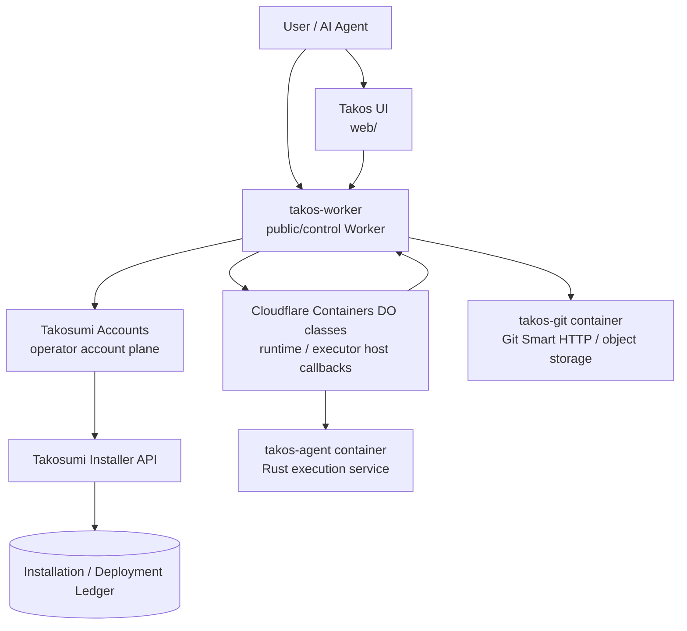
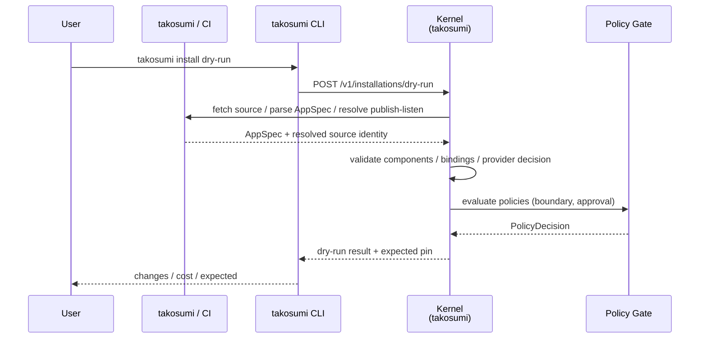
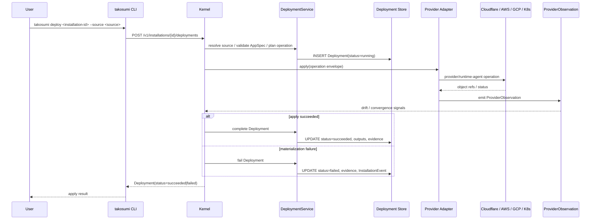
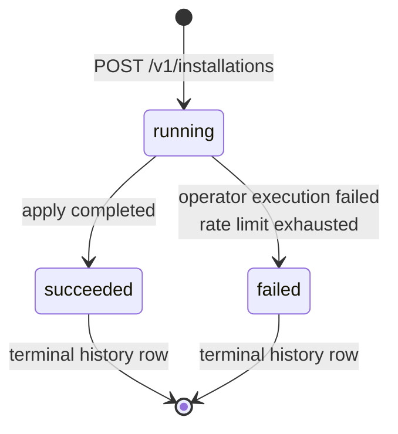
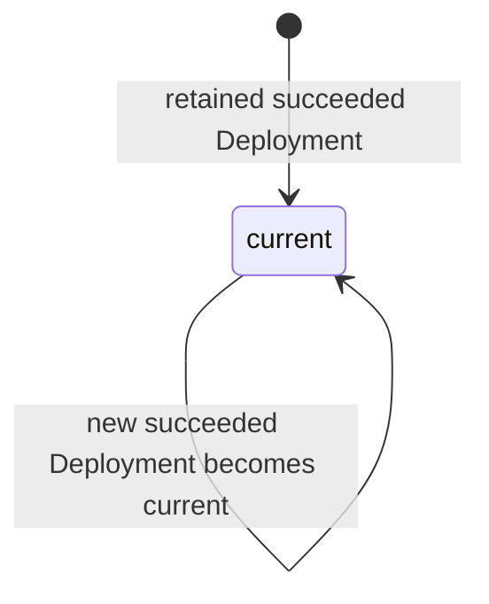

# Architecture Diagrams

> このページでわかること: Takos エコシステムの主要な component / sequence /
> state 関係を mermaid 図で俯瞰する。文字情報は
> [System Architecture](./system-architecture.md) と
> [Takosumi AppSpec](https://takosumi.com/docs/reference/manifest)
> を元にした図示版。

## ねらい

- 新規参加者が Takos の主要 component を 1 枚で把握できるようにする
- AppSpec / Installation / Deployment の public model を可視化する
- reference implementation internals は別 section として読む

## Component Diagram

Public model は AppSpec → Installation → Deployment で止まります。`takos-worker` は
Takos product API を所有し、install / update workflow は operator account plane
(リファレンス実装: Takosumi Accounts) を経由して Takosumi Installer API
に接続します。

ポイント:

- Takosumi public concept は AppSpec / Installation / Deployment
- cloud / OS credential、provider adapter、runtime-agent、WAL は reference
  implementation internals
- Takos product public API surface は `takos-worker` が所有する。Takosumi Installer
  API は operator / automation 向けの別 surface として扱う
- Cloudflare Containers の runtime / executor host は同じ `takos-worker`
  script 内の DO class として deploy し、追加の host Worker service を前提にしない

## Sequence Diagram: Installation Dry-run

Takosumi installer の dry-run シーケンス。`.takosumi.yml` (= AppSpec)
を読み、変更差分と expected pin を response として返す。dry-run は Deployment
entity として永続化しない。

dry-run 段階では provider への副作用はない。失敗時は validation / policy /
provider resolution の理由が response error として返る。

## Reference Implementation Internals: applyDeployment

Installer API apply が Deployment を append し、provider / runtime-agent 側に
operation envelope を渡す更新系シーケンス。reference kernel は内部 WAL で retry
を整理できますが、public Installer API は caller-supplied idempotency key
を受け取りません。

## State Machine: Deployment Lifecycle

Deployment 行が取りうる主要 state とその遷移。`succeeded` / `failed` は terminal
status です。新しい apply は新しい Deployment を作り、rollback は
`Installation.currentDeploymentId` と retained activation evidence を retained
`succeeded` Deployment へ戻します。

state 遷移の補足:

- `running -> failed`: operator execution 側で recoverable retry を使い切った
  failure が観測されると failed に落ちる。retry policy が許す限り running のまま
  retry する
- new apply / repair: 既存 Deployment を running に戻さず、新しい Deployment row
  を append して `running` から始める
- rollback: retained succeeded Deployment を current pointer と retained
  activation evidence の authority として再選択する。historical Deployment
  record は改竄せず、新しい Deployment も作らない

## 関連ドキュメント

- [System Architecture](./system-architecture.md) — service / repository
  boundary の詳細
- [Deploy System](https://github.com/tako0614/takosumi/blob/main/docs/reference/architecture/deploy-system.md)
  — primitive と group 機能の deploy pipeline
- [Takosumi AppSpec](https://takosumi.com/docs/reference/manifest) — AppSpec /
  Installation / Deployment の current contract
- [Status Output](https://github.com/tako0614/takosumi/blob/main/docs/reference/status-output.md)
  — operator-facing status summary と InstallationEvent の読み方
- [Operations: Troubleshooting](https://github.com/tako0614/takos-private/blob/master/docs/operations/troubleshooting.md)
  —実運用での failure 対応
- [Performance Baseline](/performance/baseline) — kernel resolve / apply の
  baseline 値
