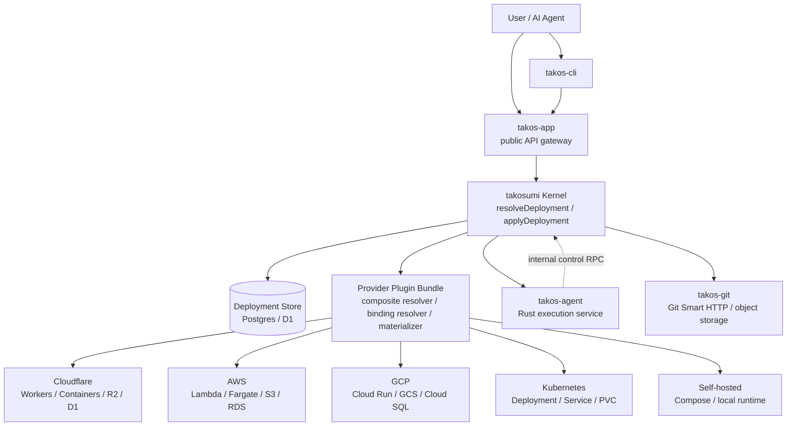
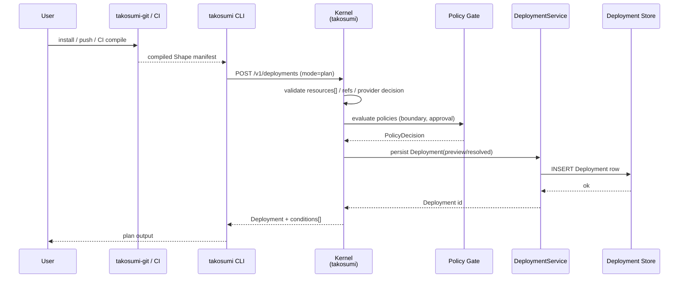
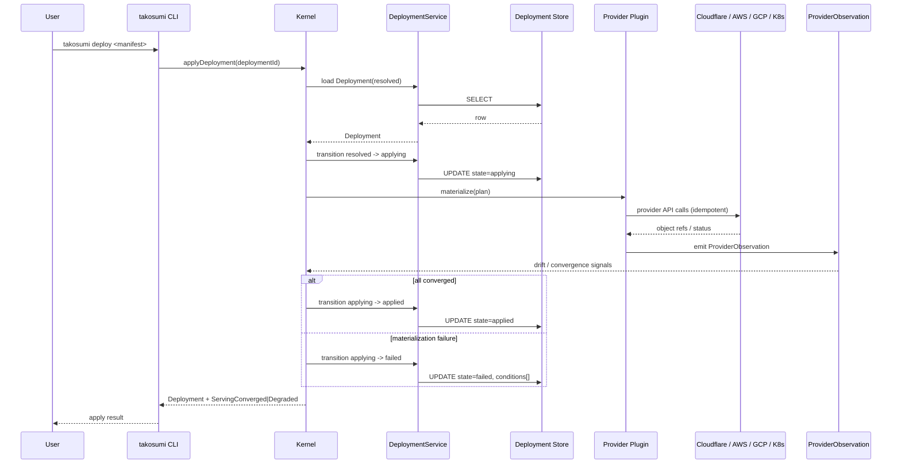
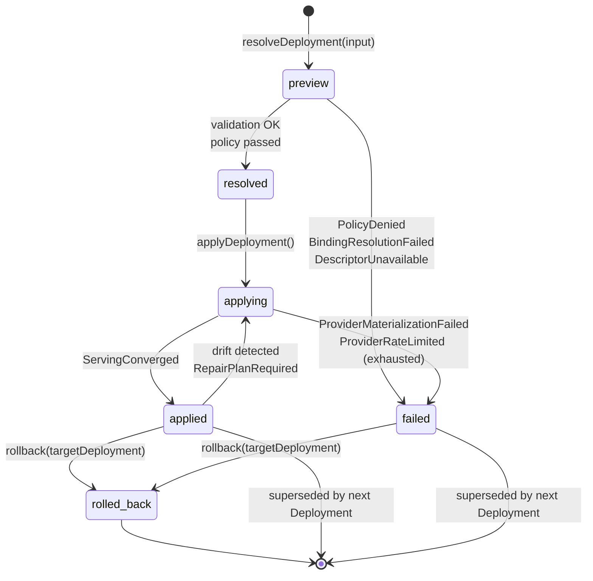

# Architecture Diagrams

> このページでわかること: Takos エコシステムの主要な component / sequence /
> state 関係を mermaid 図で俯瞰する。文字情報は
> [System Architecture](./system-architecture.md) と
> [Core Contract v1.0](https://github.com/tako0614/takosumi/blob/master/docs/reference/manifest-spec.md) を正本とし、本
> ページはその図示版として位置付ける。

## ねらい

- 新規参加者が Takos の主要 component を 1 枚で把握できるようにする
- `resolveDeployment` / `applyDeployment` / rollback の主要 sequence を可視化する
- Deployment lifecycle の state 遷移を condition reason との対応付きで示す

## Component Diagram

Takosumi kernel (`takosumi`) を中心に、user / AI agent から provider 実体まで
の主要 component を表す。 `takos-app` は public API gateway として user request
を kernel に橋渡しする。 provider plugin bundle は kernel の lookup で動的に
読み込まれ、Cloudflare / AWS / GCP / Kubernetes / Self-hosted 各 target に
materialize する。

ポイント:

- kernel は plugin bundle を介してのみ provider に到達する。直接 Cloudflare /
  AWS SDK を call しない
- agent service は kernel の internal control RPC を呼び戻す single-direction
  dependency を持つ。tenant runtime からの直接 outbound は存在しない
- public API surface は `takos-app` に閉じ、kernel は internal API のみ公開する

## Sequence Diagram: resolveDeployment

kernel direct deploy の参照系シーケンス。takosumi-git を使う場合は、この前段で
`.takosumi/manifest.yml` の `workflowRef` / installer placeholder が解決され、
kernel には compiled Shape manifest だけが届く。

resolve 段階では provider への副作用はない。失敗時は `conditions[].reason`
として validation / policy / provider resolution の理由が付き、Deployment は
`preview` のまま保留される。

## Sequence Diagram: applyDeployment

resolved Deployment を実際に provider に materialize する更新系シーケンス。
provider plugin の `materialize` は冪等であることを契約とし、kernel は
`ProviderObservation` を介して drift を観測する。

## State Machine: Deployment Lifecycle

Deployment 行が取りうる主要 state とその遷移。 condition reason との対応は
[Condition Reason Catalog](https://github.com/tako0614/takosumi/blob/master/docs/reference/status-output.md) を参照。

state 遷移の補足:

- `preview -> resolved`: read set / descriptor closure / binding が揃った時点で
  resolved に進む。途中で descriptor 側が動いた場合は `ReadSetChanged` 付きで
  preview に留まる
- `applying -> failed`: provider 側で `ProviderMaterializationFailed` /
  `ProviderRateLimited` が観測されると failed に落ちる。retry policy が許す限り
  applying のまま retry する
- `applied -> applying`: `ProviderConfigDrift` / `ProviderStatusDrift` を観測した
  場合に repair plan が組まれ、applying に再突入する
- `rolled_back`: 直近 healthy Deployment の resolved graph を再 apply する。
  `RollbackIncompatible` 等で失敗した場合は failed に落ちる

## 関連ドキュメント

- [System Architecture](./system-architecture.md) — service / repository
  boundary の正本
- [Deploy System](https://github.com/tako0614/takosumi/blob/master/docs/reference/architecture/deploy-system.md) — primitive と group 機能の deploy
  pipeline
- [Core Contract v1.0](https://github.com/tako0614/takosumi/blob/master/docs/reference/manifest-spec.md) — Deployment /
  ProviderObservation など Core 定義
- [Condition Reason Catalog](https://github.com/tako0614/takosumi/blob/master/docs/reference/status-output.md) —
  `Deployment.conditions[].reason` の正本
- [Operations: Troubleshooting](https://github.com/tako0614/takos-private/blob/master/docs/operations/troubleshooting.md) — 実運用での
  failure 対応
- [Performance Baseline](/performance/baseline) — kernel resolve / apply の
  baseline 値
