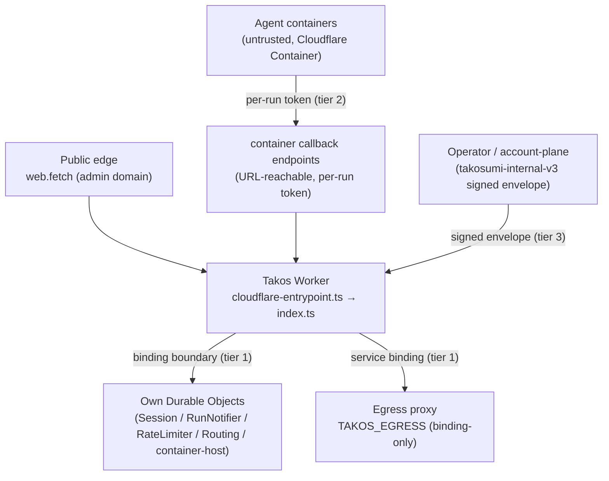

# アーキテクチャ図

**Takos は 1 つの provider 中立リソース契約と、1 つの現行 product-graph adapter を
持ちます。** Cloudflare provider-gap bridge は既定で無効で、通常の production apply は
未対応の差分を未解決のまま残します。使い捨ての E2E は reviewed な mode を明示的に
選びます。Takosumi は `deploy/opentofu/cloudflare` を普通の Capsule として
install / apply し、**Capsule → Run → StateVersion → Output** を記録します。
接続 (credential) は ProviderConnection が参照を持ち、ProviderBinding が provider を
明示的な ProviderConnection に解決し、policy が provider の許可リストと state の
扱いを解決します。

## デプロイの流れ (Takosumi の実行履歴)

```mermaid
flowchart LR
  M["Takos product contract<br/>deploy/product-resources.json"]
  DA["Current adapter<br/>deploy/opentofu/cloudflare"]
  subgraph TS["Takosumi (deploy control plane)"]
    I["Capsule"]
    P["`plan` type Run<br/>(tofu plan)"]
    AP["`apply` type Run<br/>(tofu apply)"]
    DP["`destroy_plan` / `destroy_apply`<br/>(teardown)"]
    O["Output<br/>(non-secret URLs / binding map)"]
  end
  RP["ProviderConnection / ProviderBinding / policy<br/>provider allowlist · credentials ·<br/>state backend · Container execution"]
  M --> DA --> I --> P --> AP --> S["StateVersion"] --> O
  I --> DP
  RP -. owns execution & credentials .-> P
  RP -. owns execution & credentials .-> AP
```

Cloudflare adapter は D1 / KV / R2 / Queues を用意し、runtime 専用の配線に
Wrangler を使います。product contract 自体は変更しません。

## 直接の Cloudflare runtime profile (Worker 1 つ)

```mermaid
flowchart TB
  Edge["Public edge<br/>web.fetch (admin domain)"]
  W["Takos Worker<br/>cloudflare-entrypoint.ts → index.ts"]
  DO["Own Durable Objects<br/>(Session / RunNotifier / RateLimiter / Routing / container-host)"]
  Eg["Egress proxy<br/>TAKOS_EGRESS (binding-only)"]
  RH["container callback endpoints<br/>(URL-reachable, per-run token)"]
  C["Agent containers<br/>(untrusted, Cloudflare Container)"]
  Op["Operator / account-plane<br/>(takosumi-internal-v3 signed envelope)"]

  Edge --> W
  W -- binding boundary (tier 1) --> DO
  W -- service binding (tier 1) --> Eg
  C -- per-run token (tier 2) --> RH
  RH --> W
  Op -- signed envelope (tier 3) --> W
```

この図は直接の Cloudflare adapter であり、provider 中立の product contract では
ありません。Takoform host は同じ論理 binding と agent service を自分の backend で
投影します。トラスト境界は、選択され Takosumi が適用した topology の性質であり、
reviewed な plan で検証されます。tier 1 (binding 境界)、tier 2 (実行ごとの
capability token)、tier 3 (署名付きリクエスト envelope) の判断は
[内部トラスト境界](./internal-trust-boundaries.md)を参照してください。

## 境界

Takos は product 面 (chat、agent、memory、Workspace、Git service profile の UX、
同梱アプリの launcher metadata、file-handler metadata、MCP 向け product metadata)
を持ちます。Takosumi は実行履歴 (Capsule / Run / StateVersion / Output) と
ProviderConnection / ProviderBinding / policy が所有する実行を記録します。
Takosumi Accounts plane はアカウントの policy (アカウント、課金、OIDC、dashboard)
を持ちます。

## 関連ページ

- [Deploy overview](/deploy/)
- [内部トラスト境界](./internal-trust-boundaries.md)
- [Takosumi concepts](https://takosumi.com/docs/concepts/)
