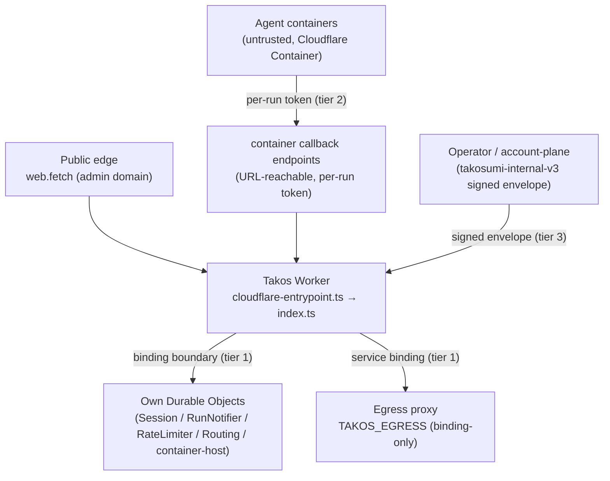

# Architecture Diagrams

**Takos owns one provider-neutral resource contract with sibling deployment adapters.** Takosumi installs and applies either `deploy/opentofu/takoform` or `deploy/opentofu/cloudflare` as an ordinary Capsule, recording **Capsule -> Run -> StateVersion -> Output**. Connections hold credential references, ProviderBindings resolve the selected provider to an explicit ProviderConnection, and policy resolves provider allowlists and state handling.

## Deploy flow (Takosumi run ledger)

```mermaid
flowchart LR
  M["Takos product contract<br/>deploy/product-resources.json"]
  DA["Selected adapter<br/>deploy/opentofu/takoform or deploy/opentofu/cloudflare"]
  subgraph TS["Takosumi (deploy control plane)"]
    I["Capsule"]
    P["`plan` type Run<br/>(tofu plan)"]
    AP["`apply` type Run<br/>(tofu apply)"]
    DP["`destroy_plan` / `destroy_apply`<br/>(teardown)"]
    O["Output<br/>(non-secret URLs / binding map)"]
  end
  RP["ProviderConnection / ProviderBinding / policy<br/>provider allowlist · credentials ·<br/>state backend · Container execution"]
  M --> DA --> I --> P --> AP --> S["StateVersion"] --> O
  I --> DP
  RP -. owns execution & credentials .-> P
  RP -. owns execution & credentials .-> AP
```

The direct Cloudflare adapter provisions D1 / KV / R2 / Queues and uses Wrangler for runtime-only wiring. The Takoform adapter asks the selected host to implement the same logical resources and connections. Neither adapter changes the product contract.

## Direct Cloudflare runtime profile (one Worker)

```mermaid
flowchart TB
  Edge["Public edge<br/>web.fetch (admin domain)"]
  W["Takos Worker<br/>cloudflare-entrypoint.ts → index.ts"]
  DO["Own Durable Objects<br/>(Session / RunNotifier / RateLimiter / Routing / container-host)"]
  Eg["Egress proxy<br/>TAKOS_EGRESS (binding-only)"]
  RH["container callback endpoints<br/>(URL-reachable, per-run token)"]
  C["Agent containers<br/>(untrusted, Cloudflare Container)"]
  Op["Operator / account-plane<br/>(takosumi-internal-v3 signed envelope)"]

  Edge --> W
  W -- binding boundary (tier 1) --> DO
  W -- service binding (tier 1) --> Eg
  C -- per-run token (tier 2) --> RH
  RH --> W
  Op -- signed envelope (tier 3) --> W
```

This diagram is the direct Cloudflare adapter, not the provider-neutral product contract. A Takoform host projects the same logical bindings and agent service through its own backend. Trust boundaries are properties of the selected, Takosumi-applied topology and are validated by the reviewed plan. See
[Internal trust boundaries](./internal-trust-boundaries.md) for the canonical decision on tier 1 (binding boundary),
tier 2 (per-run capability token), and tier 3 (signed-request envelope).

## Boundary

Takos owns the product surface (chat, agent, memory, Workspaces, Git service profile UX, bundled-app launcher metadata,
file-handler metadata, MCP-facing product metadata). Takosumi records the run ledger (Capsule / Run / StateVersion / Output) and the ProviderConnection / ProviderBinding / policy-owned execution. The Takosumi Accounts plane owns
account-plane policy: account, billing, OIDC, and dashboard.

## References

- [Deploy overview](/deploy/)
- [Internal trust boundaries](./internal-trust-boundaries.md)
- [Takosumi の考え方](https://takosumi.com/docs/concepts/)
