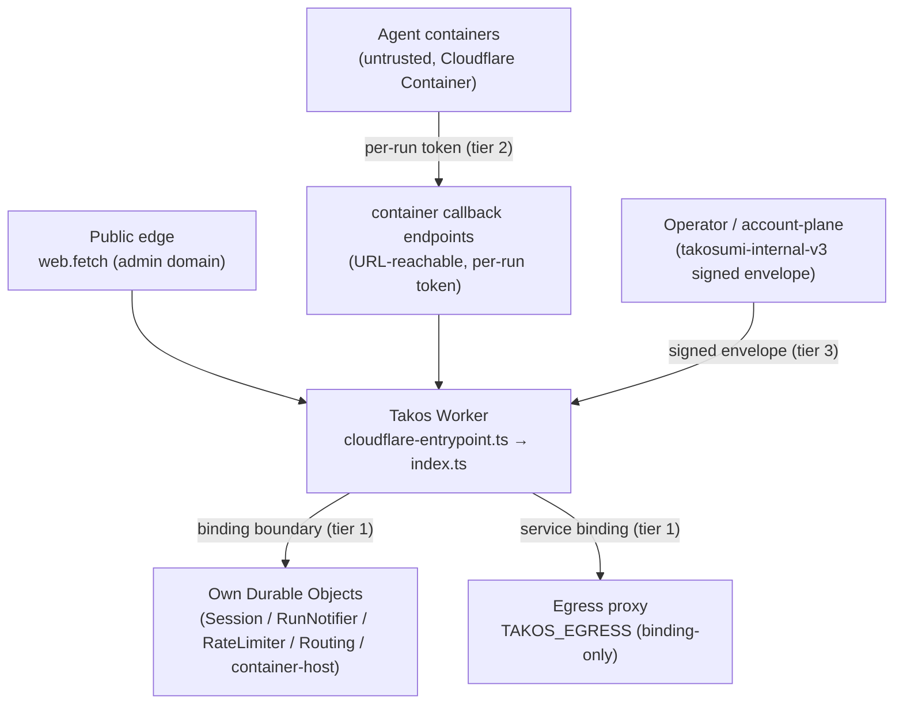

# アーキテクチャ図

**Takos は 1 つの provider-neutral resource contract と 1 つの現行 product-graph adapter を持ちます。**
Cloudflare provider-gap bridge は既定で無効、Takosumi は
`deploy/opentofu/cloudflare` を普通の Capsule として install・apply し、
**Capsule → Run → StateVersion → Output** を記録します。

## Deploy flow（Takosumi の run ledger）

```mermaid
flowchart LR
  M["Takos product contract<br/>deploy/product-resources.json"]
  DA["Current adapter<br/>deploy/opentofu/cloudflare"]
  subgraph TS["Takosumi (deploy control plane)"]
    I["Capsule"]
    P["`plan` type Run<br/>(tofu plan)"]
    AP["`apply` type Run<br/>(tofu apply)"]
    DP["`destroy_plan` / `destroy_apply`<br/>(teardown)"]
    O["Output<br/>(non-secret URLs / binding map)"]
  end
  RP["ProviderConnection / ProviderBinding / policy<br/>provider allowlist · credentials ·<br/>state backend · Container execution"]
  M --> DA --> I --> P --> AP --> S["StateVersion"] --> O
  I --> DP
  RP -. owns execution & credentials .-> P
  RP -. owns execution & credentials .-> AP
```

Cloudflare adapter は D1 / KV / R2 / Queues を provision し、runtime だけの配線に
Wrangler を使います。product contract 自体は変えません。

## Direct Cloudflare runtime profile（1 つの Worker）

```mermaid
flowchart TB
  Edge["Public edge<br/>web.fetch (admin domain)"]
  W["Takos Worker<br/>cloudflare-entrypoint.ts → index.ts"]
  DO["Own Durable Objects<br/>(Session / RunNotifier / RateLimiter / Routing / container-host)"]
  Eg["Egress proxy<br/>TAKOS_EGRESS (binding-only)"]
  RH["container callback endpoints<br/>(URL-reachable, per-run token)"]
  C["Agent containers<br/>(untrusted, Cloudflare Container)"]
  Op["Operator / account-plane<br/>(takosumi-internal-v3 signed envelope)"]

  Edge --> W
  W -- binding boundary (tier 1) --> DO
  W -- service binding (tier 1) --> Eg
  C -- per-run token (tier 2) --> RH
  RH --> W
  Op -- signed envelope (tier 3) --> W
```

この図は direct Cloudflare adapter であり、provider-neutral の product contract ではありません。
Takoform host は同じ論理 binding と agent service を自分の backend で投影します。
trust boundary は選択され Takosumi が apply したトポロジーの性質であり、reviewed plan で
検証されます。tier 1（binding boundary）、tier 2（per-run capability token）、
tier 3（signed-request envelope）の正本は
[Internal trust boundaries](./internal-trust-boundaries.md) を参照してください。

## 次に読む

- [システムアーキテクチャ](/architecture/system-architecture)
- [Internal trust boundaries](./internal-trust-boundaries.md)
- [セルフホスト概要](/deploy/)
